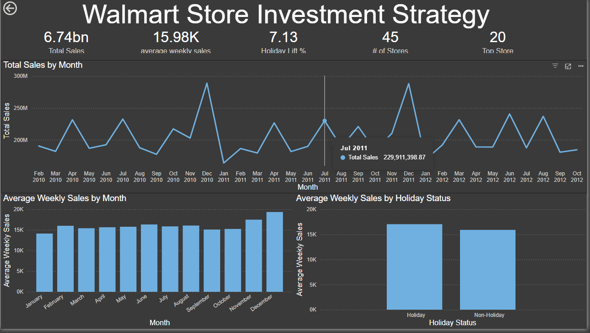
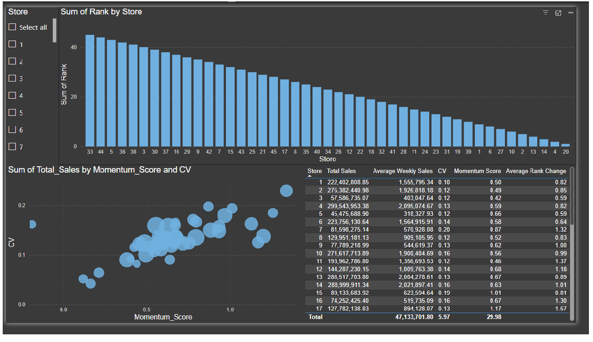
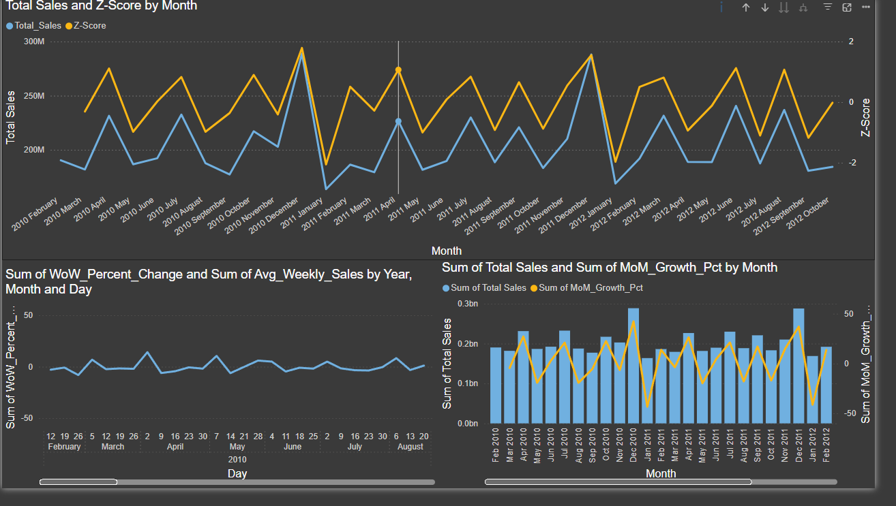
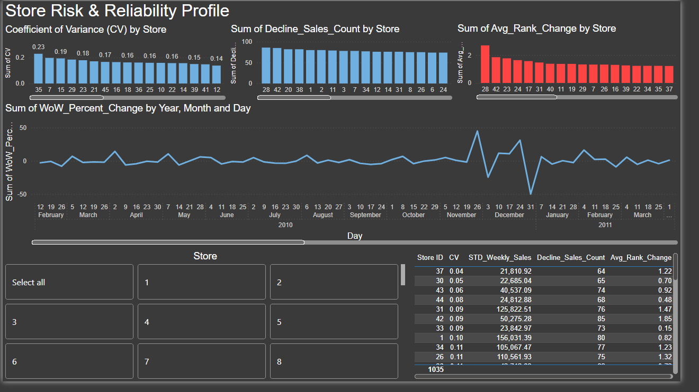

# Walmart Store Performance KPI Analysis

**Which stores are worth investing in — and when is the right time to act?**

An end-to-end data analytics project analyzing 45 Walmart stores across 143 weeks (Feb 2010 – Oct 2012), covering $6.74 billion in total weekly sales. Built to demonstrate a full analytics workflow: raw data → ETL → SQL KPIs → Python analysis → Power BI dashboard.

---

## Dashboard Preview

### Page 1 — Executive Overview


### Page 2 — Store Investment Matrix


### Page 3 — Timing & Trend Intelligence


### Page 4 — Store Risk & Reliability Profile


---

## Key Findings

- **Top 5 stores dominate revenue** — Stores 20, 4, 14, 13, and 2 lead the network, with Store 20 generating $301.4M over the analysis period. These function as anchor assets and set the performance benchmark for the chain.
- **Holiday timing drives a 7.1% sales lift** — Holiday weeks averaged $17,035 vs. $15,901 for non-holiday weeks. December peaked at $19,355/week — nearly $5,000 above January's low — confirming that calendar timing is a major revenue lever.
- **13 of 45 stores flagged as high-risk** — Over 28% of the network exceeded the decline frequency threshold, including Store 28 (86 declining weeks) and Store 42 (85). Even top-revenue Store 20 showed 82 declining weeks, showing that raw volume masks operational risk.
- **5 stores show dangerous volatility** — Stores 35, 7, 15, 29, and 23 have coefficients of variation above 17%, making them difficult to forecast and operationally expensive to manage.
- **Momentum scoring separates growers from decliners** — SQL-derived momentum scores identify stores with improving trajectories versus those in sustained contraction, enabling proactive resource allocation.

---

## Tech Stack

| Layer | Tools |
|---|---|
| Data Storage | SQLite (`walmart.db`) |
| ETL | Python, Pandas (`etl/etl.py`) |
| Analysis | Python, Pandas, NumPy, Matplotlib, Seaborn |
| SQL KPIs | SQLite via `ipython-sql` / `sqlite3` |
| Reporting | Jupyter Notebooks, python-docx |
| Dashboard | Power BI Desktop |

---

## Project Structure

```
walmart-kpi-project/
├── data/
│   ├── raw/                      # Source CSVs (train.csv, features.csv, stores.csv)
│   └── processed/                # 10 exported CSVs for Power BI
├── db/
│   └── walmart.db                # SQLite database
├── etl/
│   └── etl.py                    # Loads raw CSVs into SQLite
├── notebooks/
│   ├── 01_EDA.ipynb              # Exploratory analysis, volatility, holiday comparison
│   ├── 02_SQL_KPIs.ipynb         # SQL KPIs: WoW change, rank consistency, momentum
│   ├── 03_Volatility&Risk.ipynb  # CV, downside risk, performance-risk scatter
│   └── 04_Time_Series_Trend.ipynb # Monthly trends, seasonality, Z-score anomalies
├── reports/
│   ├── walmart_executive_summary.txt / .docx
│   └── screenshots/              # Dashboard page screenshots
├── export_for_powerbi.py         # Generates all 10 processed CSVs
├── generate_summary.py           # Generates executive summary report
└── WalmartKPIDashboard.pbix      # Power BI dashboard file
```

---

## Notebooks Overview

| Notebook | Focus |
|---|---|
| `01_EDA.ipynb` | Sales distribution, top/bottom stores, holiday lift, volatility ranking |
| `02_SQL_KPIs.ipynb` | Week-over-week change, store rank consistency, momentum scoring |
| `03_Volatility&Risk.ipynb` | Coefficient of variation, downside risk, performance-risk scatter |
| `04_Time_Series_Trend.ipynb` | Monthly trends, seasonality index, Z-score anomaly detection |

---

## Dashboard Structure (Power BI)

- **Page 1 — Executive Overview:** KPI cards, weekly sales trend line, seasonality bar chart, holiday comparison
- **Page 2 — Store Investment Matrix:** Scatter plot (Momentum vs. CV, sized by Total Sales) with 4 investment quadrants, store ranking bar chart, full store table
- **Page 3 — Timing & Trend Intelligence:** Z-score anomaly bands, WoW % change, monthly sales with MoM growth overlay
- **Page 4 — Store Risk & Reliability Profile:** Downside risk, decline frequency, CV by store

---

## Dataset

Source: [Walmart Store Sales Forecasting — Kaggle](https://www.kaggle.com/competitions/walmart-recruiting-store-sales-forecasting)

- 45 stores, 143 weeks, 81 departments
- Features: weekly sales, store type/size, temperature, fuel price, CPI, unemployment, holiday flags
